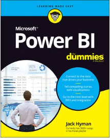
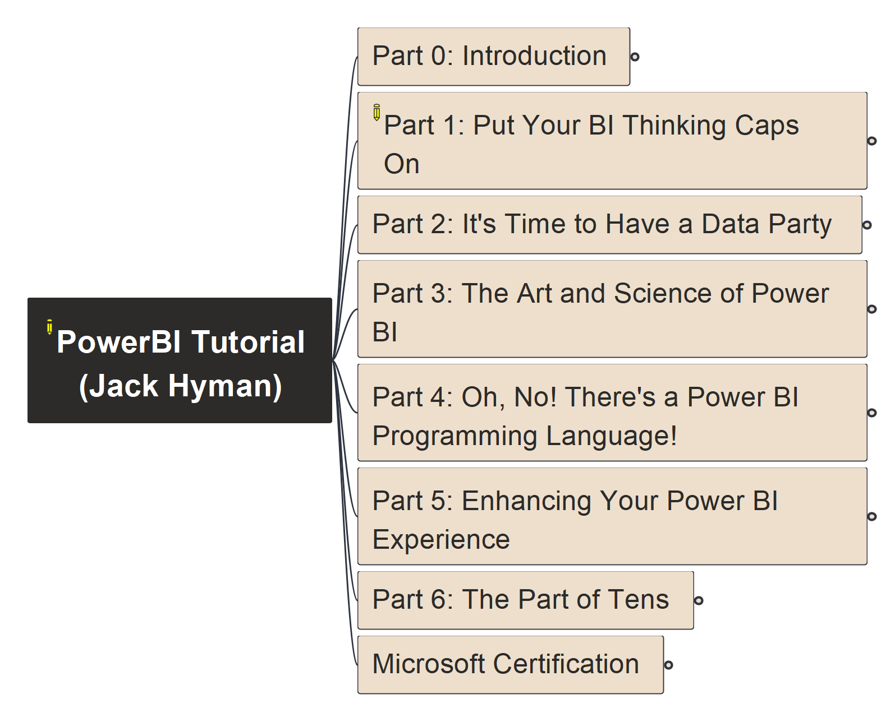

# PowerBI_Tutorial

Base on "PowerBI Tutorial" book, provide step by step video demo on learning and mastering Power BI tool

---

|  | Get the book: [Amazon](https://www.amazon.com/Microsoft-Power-Dummies-Jack-Hyman/dp/1119824877), [Wiley](https://www.wiley.com/en-us/Microsoft+Power+BI+For+Dummies-p-9781119824893) |
| --- | --- |

---

Book structure, the online course will base on the book's chapter in sequence and adding practical demo & sharing:

<!--  -->

You may read the mindmap's export [here in Markdown](PowerBI_Tutorial.md), well, better you install FreePlace to open the mindmap file directly!

---

Stay tunes for the course being publishing soon...