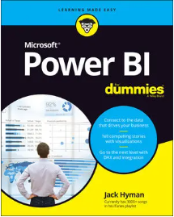
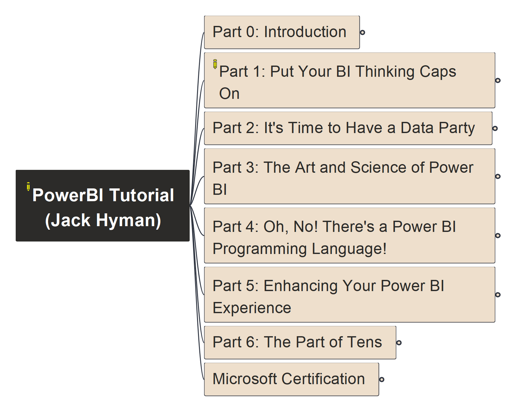

# PowerBI_Tutorial

Base on "PowerBI Tutorial" book, provide step by step video demo on learning and mastering Power BI tool

---

| Book Cover | Contents | 
| --- | --- |
|  Get the Book: [Amazon](https://www.amazon.com/Microsoft-Power-Dummies-Jack-Hyman/dp/1119824877), [Wiley](https://www.wiley.com/en-us/Microsoft+Power+BI+For+Dummies-p-9781119824893) |  |

---

The online course will base on the book's chapter in sequence and adding practical demo & sharing:

<!--  -->

- [Part 1: Put Your BI Thinking Caps On](./part1/README.md)
- Part 2: It's Time to have a Data Party
- Part 3: The Art and Science of Power BI
- Part 4: Oh, No! There's a Power BI Programming Language!
- Part 5: Enhancing Your Power BI Experience
- Part 6: The Part of Tens
- ...road to Microsoft Certification relating to Power BI

You may read the mindmap's export [here in Markdown](PowerBI_Tutorial.md), well, better you install FreePlane to open the mindmap file directly!

## Demo Videos

- [Packaged Courses in Udemy](): coming sooning, and thanks for your supporting!
- [Video list in YouTube channel](https://www.youtube.com/playlist?list=PL6DEHvciXKeWoB90UGYbddjFy-PufqDXs): this is sharing free, welcome to subscribe or become members to my channel!

## Find Datasets for Practicing

- [kaggle datasets library](https://www.kaggle.com/datasets)
- [data world sample datasets (need login)](https://data.world/datasets/open-data)
- [google dataset search](https://datasetsearch.research.google.com/)
- [US Data.Gov Catalog](https://catalog.data.gov/dataset/)
- Sample data with longitude and latitude for Map
  - [World Cities Database](https://simplemaps.com/data)
  - [OpenFlights Airports Database](https://openflights.org/data.html)
  - [SGS Earthquake Data](https://earthquake.usgs.gov/earthquakes/feed/v1.0/csv.php)
  - [Global Power Plant Database](https://datasets.wri.org/dataset/globalpowerplantdatabase)
  - [World Heritage Sites](https://whc.unesco.org/en/list/xls/)

---

Last Updated as 2026-01-11