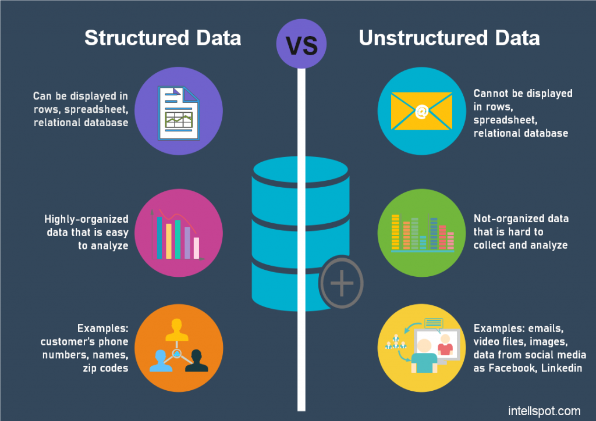

# Part 1 - Chapter 01 - Data Analytics Terms

- [Part 1 - Chapter 01 - Data Analytics Terms](#part-1---chapter-01---data-analytics-terms)
  - [Structured Data vs. Unstructured Data](#structured-data-vs-unstructured-data)

## Structured Data vs. Unstructured Data

Some reference articles:

- [IBM: Structured vs. unstructured data: What's the difference?](https://www.ibm.com/think/topics/structured-vs-unstructured-data)
- [Data Stack Hub: Structured vs Unstructured Data: Key Differences Guide](https://www.datastackhub.com/compare/structured-vs-unstructured-data/)
- [AWS: What’s the Difference Between Structured Data and Unstructured Data?](https://aws.amazon.com/compare/the-difference-between-structured-data-and-unstructured-data/)

