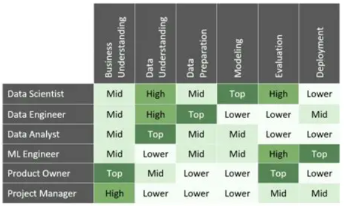
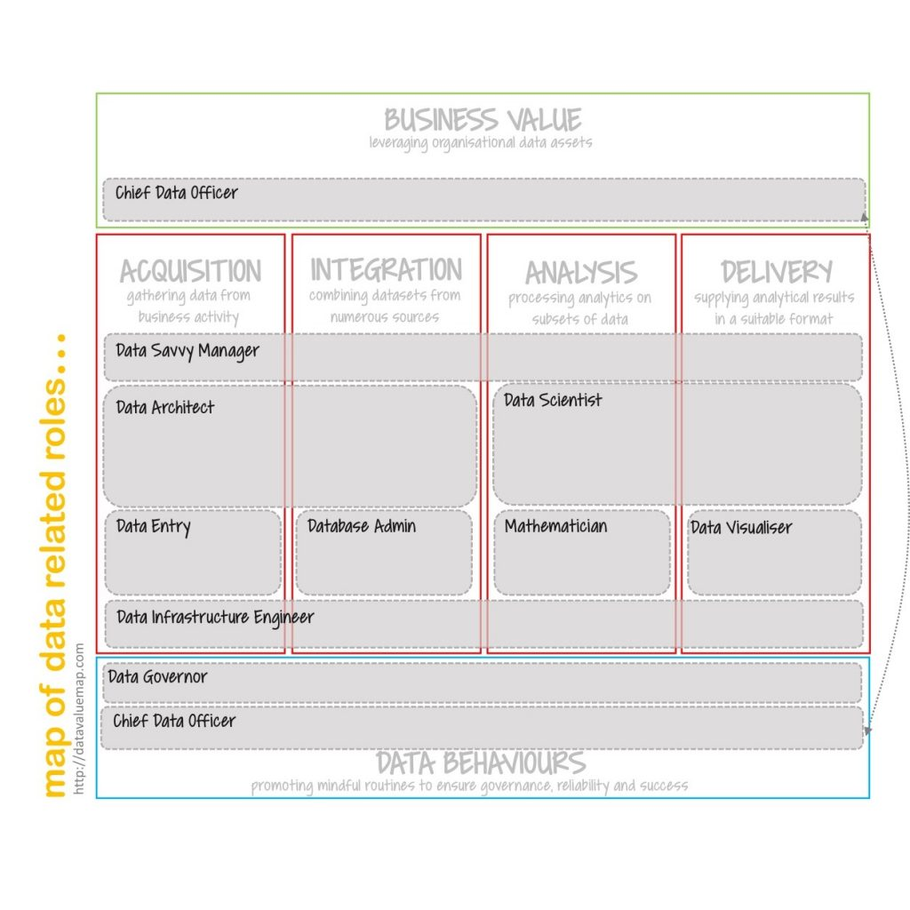

# Part 1 - Chapter 02 - The Who, How, and What of Power BI

- [Part 1 - Chapter 02 - The Who, How, and What of Power BI](#part-1---chapter-02---the-who-how-and-what-of-power-bi)
  - [2.1 Highlighting who of Power BI](#21-highlighting-who-of-power-bi)
  - [2.2 How Data Comes to Life?](#22-how-data-comes-to-life)
  - [2.3 What - various type of data anlaystics](#23-what---various-type-of-data-anlaystics)

## 2.1 Highlighting who of Power BI

Data Related Job Roles:

Another refernece: [A map of data related roles](http://datavaluemap.com/a-map-of-data-related-roles/), with following matrix --

## 2.2 How Data Comes to Life?

| Steps | Explanation |
| --- | --- |
| 1. Prepare | Data preparation requires a business analyst to evaluate the business's needs and a data analyst to construct an appropriate data profile for cleansing and tranformation.|
| 2. Model | Data modeling can be seens as a process where all of raw pieces of data have been formalized and structured. The goal is to decide how the organized datasets can relate to each other. |
| 3. Visualize | Visualizing data helps organizations better understand business problems in ways that plain text can't convey. "A picture is worth a thousand words"! |
| 4. Analyze | Data analysis is the step in process when crafting data model and interpreting visualizations. | 
| 5. Manage | Power BI consists of lots of different apps, which reuqire variable ways for managing after the report is ready. |

## 2.3 What - various type of data anlaystics

Quick snapshot of data analytics work:

| Type | Question it answers | Common Techniques | Use Cases |
| --- | --- | --- | --- |
| Descriptive | What happended? | Dashboards, Reporting, Data Aggregation | KPI tracking, Sales performance |
| Diagnostic | Why did it happen? | Root cause analysis, drill paths | Customer churn analysis, campaign ROI |
| Predictive | What's likely to happen? | Forcasting, machine learning | Inventory planning, revenue forecasts |
| Prescriptive | What should we do next? | Optimization models, decision logic | Budget allocation, resource planning |
| Cognitive Analytics | | |

Source reference:

- [The 4 Types of Data Analytics Explained (Descriptive, Diagnostic, Predictive, and Prescriptive)](https://www.domo.com/learn/article/data-analytics-types)
---

Last updated at 2026-01-10